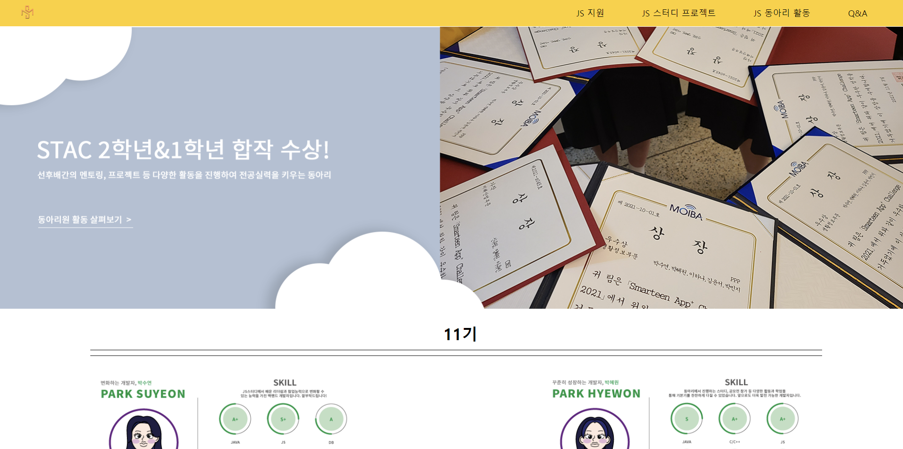
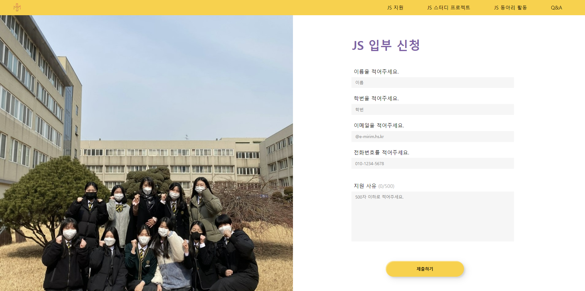
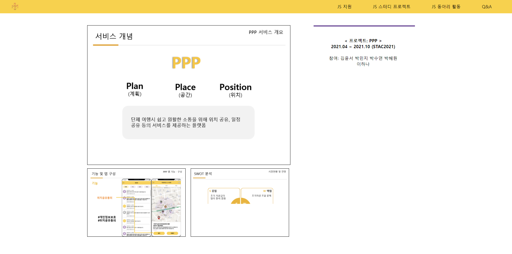
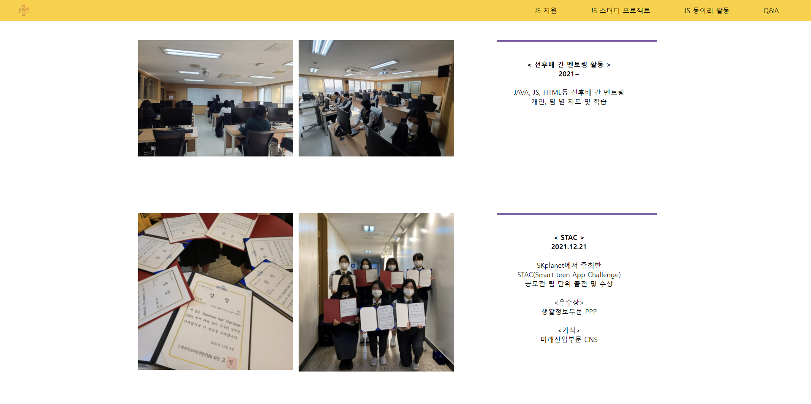
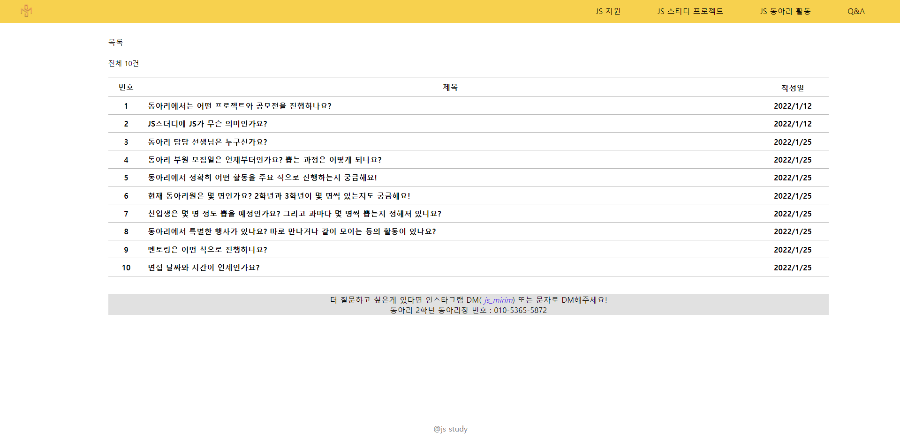
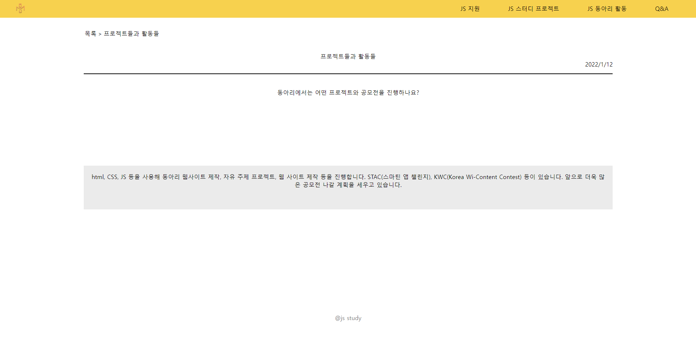

# JS스터디 웹사이트
미림여자정보과학고등학교 전공동아리 JS스터디(JS Study) 홍보 및 지원 사이트입니다. 
(2021.12 ~ 운영중)

 Website
--------------------
링크 : http://www.js-study.site:3001/  
PC로 접속 부탁드립니다. (현재 AWS 과금으로 인해 접속 할 수 없습니다)

 동아리 소개
--------------------
자바, 자바스크립트, JSP, Ajax 등의 업무 활용도가 높은 환경과 개발 언어를 학습함으로써 
실력 향상과 기초 실력을 바탕으로 새로운 기술 동향을 스스로 
공부하는 마이스터 인재로 성장하는 동아리 입니다.  

<li>지도교사 : 백현정 선생님</li> 

<li>11기 : 박수연, 박혜원, 주서영, 이하나</li>
<li>12기 : 김윤서, 임채영, 신유림, 양혜원, 전수연, 박민지</li>

 Features
--------------------
<ul>
  <li>JS지원</li>
  <li>JS프로젝트</li>
  <li>JS활동</li>
  <li>Q&A</li>
</ul>

 실행 화면
--------------------
#### 메인 화면

#### JS 지원

#### JS 프로젝트

#### JS 활동

#### Q&A

 Built With
--------------------
<ul>
  <li>AWS - Server Hosting</li>
  <li>Node.js - Back-end Development</li>
  <li>Mysql - Database</li>
  <li>HTML/CSS/JavaScript - Front-end Development</li>
</ul>
